# EduPilot --- Academic Intelligence Platform (AIP)

> An AI-powered academic resource and examination intelligence platform
> that centralizes faculty-approved study material, enables grounded
> RAG-based academic chat, analyzes previous-year question papers
> (PYQs), and provides role-specific workflows for students, faculty,
> and administrators.

## Project Status

**Completed / concluded:** August 2026

EduPilot was designed as an end-to-end academic intelligence system
rather than a generic chatbot. Its core principle is that academic
answers should be grounded in institution-approved resources, while
structured PYQ analytics should help students identify examination
patterns without duplicating those insights in unnecessary features.

------------------------------------------------------------------------

## Table of Contents

-   [Overview](#overview)
-   [Problem Statement](#problem-statement)
-   [Core Objectives](#core-objectives)
-   [User Roles](#user-roles)
-   [Features](#features)
-   [System Architecture](#system-architecture)
-   [End-to-End Data Flows](#end-to-end-data-flows)
-   [Technology Stack](#technology-stack)
-   [Project Structure](#project-structure)
-   [RAG Pipeline](#rag-pipeline)
-   [Conversation Memory](#conversation-memory)
-   [PYQ Intelligence Pipeline](#pyq-intelligence-pipeline)
-   [Security](#security)
-   [API Overview](#api-overview)
-   [Screenshots](#screenshots)
-   [Setup and Installation](#setup-and-installation)
-   [Configuration](#configuration)
-   [Future Improvements](#future-improvements)
-   [Design Decisions](#design-decisions)

------------------------------------------------------------------------

## Overview

**EduPilot / Academic Intelligence Platform (AIP)** is a full-stack
academic platform for engineering students, faculty, and administrators.

The application combines three major capabilities:

1.  **Academic resource management** --- faculty upload
    department-specific study material.
2.  **Retrieval-Augmented Generation (RAG)** --- students ask questions
    and receive answers grounded in uploaded academic resources.
3.  **PYQ intelligence** --- previous-year question papers are parsed
    into structured questions and analyzed for recurring topics, marks
    distribution, course outcomes, and expected-topic confidence.

The platform also contains role-based dashboards, conversation history,
department/subject administration, user management, authentication,
document processing, and profile viewing.

------------------------------------------------------------------------

## Problem Statement

Academic material is commonly distributed across disconnected sources
such as PDFs, faculty drives, messaging groups, and previous examination
papers. Students may have access to large amounts of information but
still face several problems:

-   Finding the correct resource quickly.
-   Identifying which material is institution/faculty approved.
-   Searching inside long documents.
-   Getting contextual answers without AI hallucination.
-   Understanding trends across multiple previous-year papers.
-   Identifying frequently tested topics.
-   Managing department-specific subjects and academic resources.

EduPilot addresses these problems by combining centralized academic
resource management with semantic retrieval, grounded AI assistance, and
structured examination analytics.

------------------------------------------------------------------------

## Core Objectives

-   Centralize faculty-approved academic resources.
-   Restrict academic retrieval to the student's department.
-   Generate answers using retrieved material instead of unrestricted
    model knowledge.
-   Preserve multi-turn conversational context.
-   Support multiple independent conversations per student.
-   Transform uploaded PYQs into structured examination data.
-   Generate useful PYQ analytics and topic predictions.
-   Provide dedicated workflows for students, faculty, and
    administrators.
-   Maintain secure JWT-based authentication and role-based
    authorization.

------------------------------------------------------------------------

## User Roles

### Student

Students can:

-   Log in securely.
-   View a student-specific dashboard.
-   View their profile information.
-   Access department-specific subjects.
-   Ask academic questions through RAG chat.
-   Start new conversations.
-   Continue previous conversations.
-   View recent chat history.
-   Delete conversations.
-   Receive grounded answers from faculty-uploaded resources.
-   Receive a fallback response when relevant academic material cannot
    be found.
-   Browse PYQ information.
-   Select a subject for PYQ intelligence.
-   View total uploaded papers and questions.
-   View high-frequency topics.
-   View marks distribution.
-   View course-outcome distribution.
-   View predicted/expected topics with confidence values.
-   Filter and paginate relevant views.

### Faculty

Faculty can:

-   Log in securely.
-   View a faculty-specific dashboard.
-   View their profile.
-   Upload academic resources.
-   Select a department-specific subject while uploading.
-   Enter document title and description.
-   Select files using a file picker.
-   Upload files using drag-and-drop.
-   Upload previous-year question papers.
-   Trigger automatic document/PYQ processing.
-   Contribute faculty-approved material used by student RAG retrieval.

### Administrator

Administrators can:

-   Log in securely.
-   View an administrative dashboard.
-   View system-level statistics.
-   View their profile.
-   Manage departments.
-   Create departments.
-   Edit departments.
-   Delete departments.
-   Search department records.
-   Manage subjects.
-   Create department-specific subjects.
-   Edit subjects.
-   Reassign/update subject information.
-   Delete subjects.
-   Manage registered users.
-   View users.
-   View individual user information.
-   Edit user information through administrative workflows.
-   Delete users.
-   Work with student/faculty/department/subject/document/PYQ counts.

> Normal users have a read-only profile. Administrative user management
> remains separate from self-service profile editing. Password
> recovery/change is intended to be handled through the authentication
> flow rather than the profile page.

------------------------------------------------------------------------

# Features

## 1. Authentication and Authorization

-   User registration.
-   User login.
-   JWT token generation.
-   JWT authentication filter.
-   Bearer-token authentication.
-   Custom `UserDetailsService`.
-   Role-based Spring Security authorities.
-   `STUDENT`, `FACULTY`, and `ADMIN` roles.
-   Method-level authorization using `@PreAuthorize`.
-   Current authenticated-user endpoint (`/api/auth/accounts/me`).
-   Frontend authentication context.
-   Token persistence in local storage.
-   Axios interceptor for automatic `Authorization: Bearer <token>`
    headers.
-   Protected role-specific routes.
-   Logout support.

## 2. Role-Based Dashboards

### Student Dashboard

Includes summary information such as:

-   Documents/resources.
-   Active subjects.
-   Academic/AI-related counts where configured.
-   Department information.

### Faculty Dashboard

Includes faculty-oriented summary counts such as:

-   Uploaded documents.
-   Uploaded PYQs.
-   Subjects.

### Admin Dashboard

Includes system-level counts such as:

-   Students.
-   Faculty.
-   Departments.
-   Subjects.
-   Documents.
-   Question papers.

## 3. Academic Resource Upload

Faculty can upload study material through a dedicated interface
featuring:

-   File selection.
-   Drag-and-drop upload.
-   Selected-file preview/card.
-   Resource title.
-   Description.
-   Subject selection.
-   Department-specific subject loading.
-   File validation.
-   Maximum file-size validation.
-   Upload status/progress support.
-   Success/error notifications.
-   Backend metadata persistence.
-   File storage abstraction.
-   Automatic document processing.
-   Text chunk creation.
-   Embedding generation/storage.

The uploaded content becomes the knowledge base used by the RAG
pipeline.

## 4. Department-Aware Resource Retrieval

Academic resources are associated with subjects and departments.

When a student asks a question:

-   The authenticated student is resolved.
-   The student's department is determined.
-   Semantic retrieval is scoped using the department ID.
-   Only relevant academic chunks are considered.
-   Irrelevant or low-similarity results are rejected.

This prevents unrelated department material from contaminating
responses.

## 5. RAG Academic Chat

The student chat is based on a Retrieval-Augmented Generation pipeline.

Capabilities include:

-   Natural-language academic questions.
-   Semantic retrieval.
-   Vector similarity matching.
-   Similarity threshold validation.
-   Faculty-approved context injection.
-   Grounded answer generation.
-   Technical/exam-oriented response instructions.
-   No-resource fallback behavior.
-   Citation construction support.
-   Conversation-aware follow-up questions.
-   Query rewriting.
-   Multiple chat conversations.
-   Recent conversation list.
-   Conversation titles generated from the first question.
-   Conversation deletion.
-   Full conversation loading.

Example:

``` text
Student: What is Formal Technical Review?

Student: What are the benefits of it?

Query Rewriter:
"What are the benefits of Formal Technical Review?"
```

The rewritten standalone query improves retrieval while preserving the
natural conversational experience.

## 6. Hallucination Reduction

The RAG prompt explicitly instructs the generation layer to:

-   Use only retrieved academic context.
-   Avoid external unsupported knowledge.
-   Avoid guessing.
-   Answer only available portions when context is incomplete.
-   Return a controlled fallback when relevant resources are
    unavailable.

A retrieval similarity threshold is also used before generation.

Example fallback:

``` text
No relevant academic resource found.
```

## 7. Conversation Memory

Chat memory is persisted in the database.

Each conversation contains:

-   Conversation ID.
-   User ownership.
-   Generated title.
-   Creation/update timestamps.
-   Multiple messages.

Each message contains:

-   Message ID.
-   Conversation relationship.
-   Role (`USER` / `ASSISTANT`).
-   Content.
-   Creation timestamp.

The platform supports:

-   Creating a new conversation.
-   Loading an existing conversation.
-   Listing a user's conversations.
-   Ordering conversations by recent activity.
-   Loading complete conversation history.
-   Maintaining a limited recent history for RAG.
-   Deleting conversations.
-   Updating conversation activity timestamps.

Recent RAG history is ordered chronologically before being sent to the
query-rewriting/generation pipeline.

## 8. Context-Aware Query Rewriting

Follow-up questions often contain ambiguous references:

``` text
"What are its advantages?"
"How does it work?"
"What are the benefits of it?"
```

The query-rewriting service uses recent conversation context to
transform these into standalone retrieval queries.

Example:

``` text
Previous topic:
Formal Technical Review

Current question:
What are the benefits of it?

Rewritten query:
What are the benefits of Formal Technical Review?
```

Only recent conversation messages are considered for reference
resolution, reducing interference from older unrelated topics.

## 9. Previous-Year Question Paper Upload

Faculty can upload PYQ files.

The backend processing pipeline:

1.  Receives the multipart file.
2.  Parses question-paper metadata.
3.  Extracts individual examination questions.
4.  Stores paper metadata.
5.  Extracts topics for parsed questions.
6.  Stores structured question records.
7.  Makes the data available for analytics.

Question-paper metadata includes fields such as:

-   Exam type.
-   Year.
-   Subject name.
-   Subject code.
-   Branch.
-   Total marks.
-   Upload timestamp.

Extracted question data includes:

-   Section.
-   Question number.
-   Marks.
-   Course outcome.
-   Question text.
-   Extracted topic.
-   Parent question paper.

## 10. AI-Assisted Topic Extraction

After questions are parsed from a PYQ:

-   Questions are sent through the topic-extraction workflow.
-   Each question receives an extracted academic topic.
-   The topic is persisted with the question.
-   Topic information is later aggregated for analytics.

This converts raw examination PDFs into structured data suitable for
analysis.

## 11. PYQ Intelligence Dashboard

Students select a subject and receive analytics generated from uploaded
papers.

The dashboard includes:

### Total Papers

Number of question papers available for the selected subject.

### Total Questions

Total structured examination questions available.

### Top Topics

Topics ranked by historical frequency.

Example:

``` text
Line Clipping Algorithms       3
Polygon Filling Algorithms     2
2D Geometric Transformations   2
```

### Marks Distribution

Shows how frequently different mark values occur.

Example:

``` text
2 marks → 14 questions
5 marks → 8 questions
```

### Course Outcome Distribution

Aggregates questions by course outcome.

### Expected / Predicted Topics

Topics receive prediction/confidence information based on historical
examination data.

The prediction output contains values such as:

-   Topic.
-   Frequency.
-   Latest year.
-   Confidence.

### Filtering and Pagination

Relevant analytics/data views support filtering and pagination for
usability with larger datasets.

## 12. Department Management

Administrative department management includes:

-   List departments.
-   Create department.
-   Edit department.
-   Delete department.
-   Search departments.
-   Duplicate department validation.
-   Error handling.
-   Success/error toast notifications.

Departments act as an important boundary for users, subjects, documents,
and retrieval.

## 13. Subject Management

Subjects belong to departments.

Administration includes:

-   List all subjects.
-   List subjects by department.
-   Create subject.
-   Select department while creating.
-   Update subject.
-   Change subject department.
-   Delete subject.
-   Prevent duplicate subjects within a department.
-   Department-aware subject retrieval.

Faculty upload and student analytics reuse these department/subject
relationships.

## 14. User Management

Administrative user management includes:

-   List registered users.
-   Order users by creation date.
-   View user details.
-   Display role.
-   Display department.
-   Display academic year.
-   Update supported user information through the administrative
    workflow.
-   Delete users.
-   Handle users such as administrators that may not belong to a
    department.

## 15. Read-Only User Profile

The navbar exposes a profile entry for authenticated users.

Profile information is obtained from the authenticated account endpoint
and includes:

-   Name.
-   Email.
-   Role.
-   Department, when applicable.
-   Department ID where needed internally.
-   Academic year, when applicable.

The profile is intentionally read-only for students/faculty.

## 16. Responsive User Interface

Frontend UX includes:

-   Shared dashboard layout.
-   Responsive navbar.
-   Mobile hamburger navigation.
-   Role-aware navigation.
-   Profile dropdown.
-   Animated dropdown transitions.
-   Dashboard cards.
-   Loading states.
-   Empty states.
-   Forms and modals.
-   Search.
-   Filtering.
-   Pagination.
-   Toast notifications.
-   Drag-and-drop upload.
-   Responsive Tailwind CSS layouts.
-   Lucide icons.
-   Framer Motion animations.

------------------------------------------------------------------------

# System Architecture

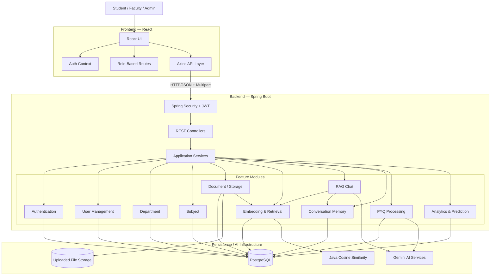

------------------------------------------------------------------------

# End-to-End Data Flows

## A. Authentication Flow

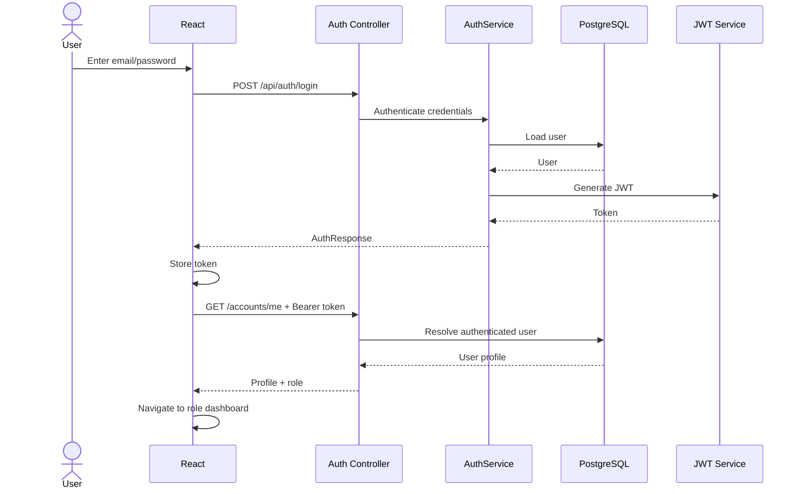

## B. Faculty Document Ingestion Flow

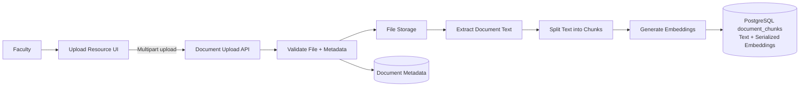

## C. Student RAG Question Flow

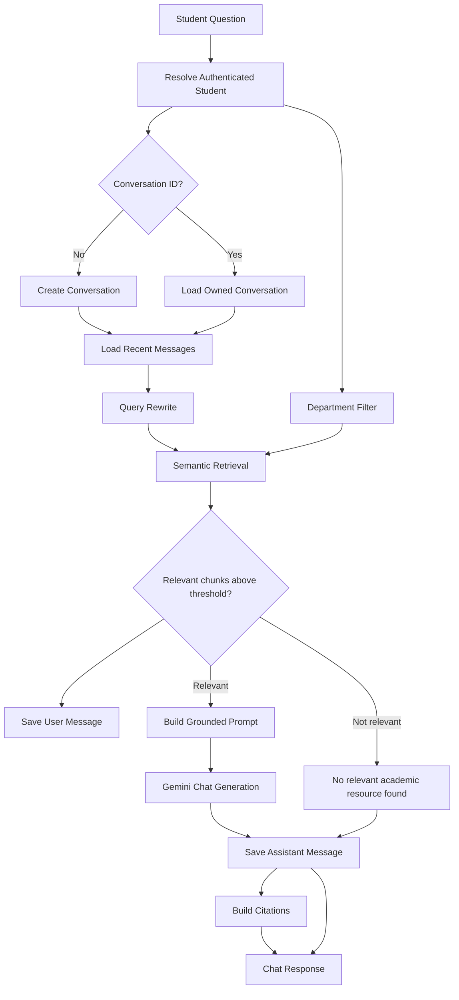

## D. Conversation Memory Flow

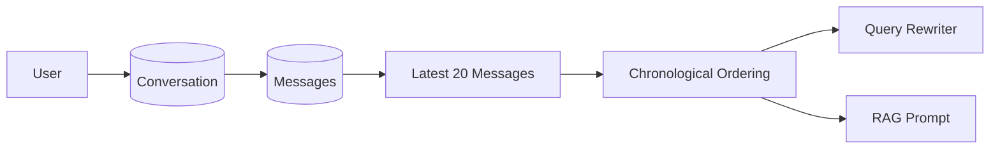

## E. PYQ Processing and Analytics Flow

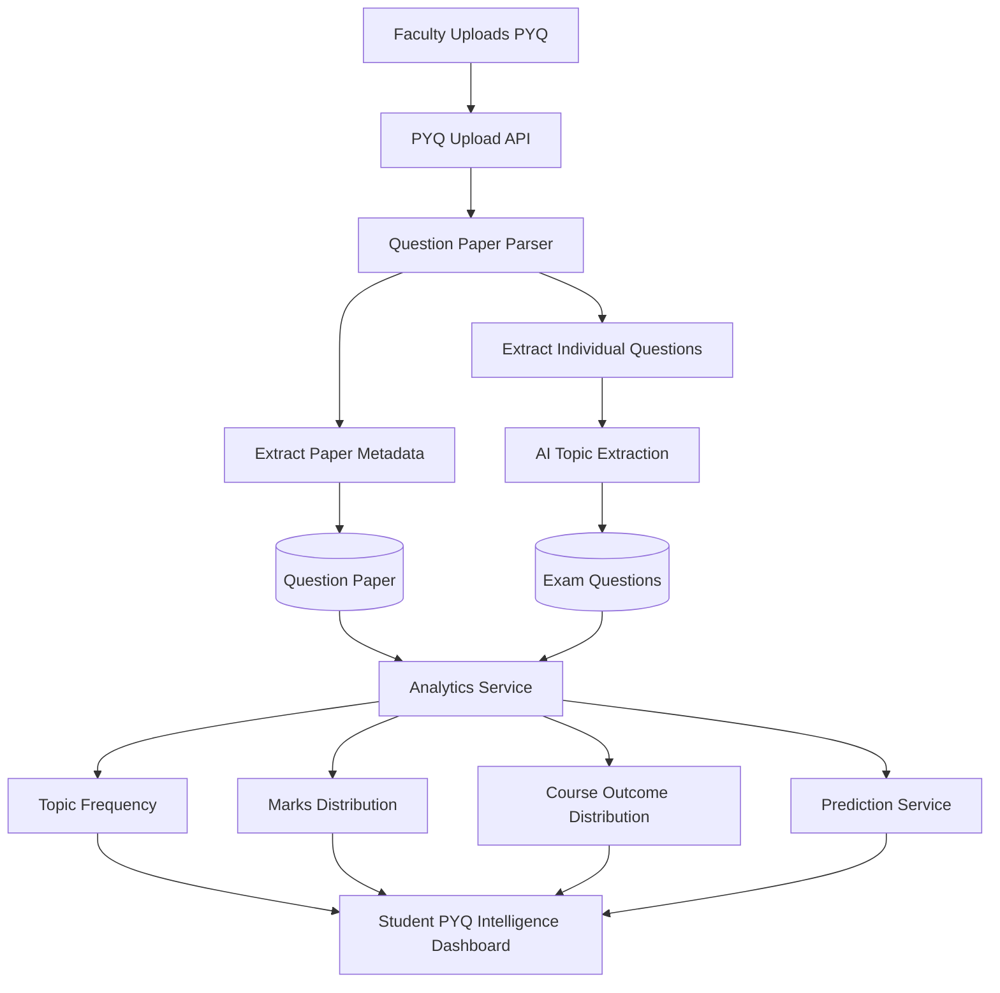

------------------------------------------------------------------------
# Technology Stack

## Frontend

| Technology | Purpose |
|---|---|
| **React** | Component-based frontend |
| **JavaScript / JSX** | Frontend application logic |
| **Vite** | Frontend development and build tooling |
| **Tailwind CSS** | Responsive UI styling |
| **Axios** | REST API communication |
| **React Context API** | Authentication state management |
| **Lucide React** | UI icons |
| **Framer Motion** | UI transitions and animations |
| **Browser Local Storage** | JWT persistence |

## Backend

| Technology | Purpose |
|---|---|
| **Java 21** | Backend programming language |
| **Spring Boot 4** | Backend application framework |
| **Spring Web / MVC** | REST API development |
| **Spring Security** | Authentication and authorization |
| **Spring Data JPA** | Persistence and repository layer |
| **Hibernate** | Object-relational mapping (ORM) |
| **Jakarta Persistence** | Entity mapping |
| **Lombok** | Boilerplate code reduction |
| **JWT** | Stateless authentication |
| **Multipart File API** | Document and PYQ uploads |

## Data & AI

| Technology | Purpose |
|---|---|
| **PostgreSQL** | Relational data, document chunks, and serialized embeddings |
| **Gemini Embedding 001** | Embedding generation for academic chunks and queries |
| **Gemini 2.5 Flash** | Answer generation, query rewriting, and vision/OCR-assisted processing |
| **Java Cosine Similarity** | Application-side semantic similarity calculation |
| **RAG** | Grounded academic question answering |

> **Embedding Storage:** Embeddings are serialized and stored in PostgreSQL with document chunks. The current implementation does not require pgvector or a separate vector database. Semantic similarity is calculated in Java using `CosineSimilarityService`.
## Development Tools

Typical project tooling includes:

-   Git.
-   GitHub.
-   IntelliJ IDEA or another Java IDE.
-   VS Code or equivalent frontend editor.
-   Postman/API client for endpoint testing.
-   npm for frontend dependency management.
-   Maven for backend dependency/build management.

------------------------------------------------------------------------
# 📁 Project Structure

EduPilot follows a modular architecture on both the frontend and backend.

- The **frontend** primarily follows a feature-oriented React structure.
- The **backend** follows a domain/module-oriented Spring Boot architecture.
- Core domains such as authentication, documents, RAG, PYQ analytics, departments, subjects, and users are separated into dedicated modules.

---

## 🎨 Frontend Architecture

```text
frontend/
│
├── src/
│   │
│   ├── assets/
│   │   └── logos/
│   │       └── edupilot_logo_transparent.png
│   │
│   ├── components/
│   │   │
│   │   ├── charts/
│   │   │   ├── COChart.jsx
│   │   │   ├── MarksChart.jsx
│   │   │   └── TopicChart.jsx
│   │   │
│   │   ├── chat/
│   │   │   ├── ChatBubble.jsx
│   │   │   ├── ChatInput.jsx
│   │   │   ├── ChatMessage.jsx
│   │   │   ├── CitationCard.jsx
│   │   │   └── ConversationSidebar.jsx
│   │   │
│   │   ├── common/
│   │   │   ├── Button.jsx
│   │   │   ├── DashboardCard.jsx
│   │   │   ├── Input.jsx
│   │   │   ├── Loading.jsx
│   │   │   ├── Modal.jsx
│   │   │   ├── Profile.jsx
│   │   │   ├── Table.jsx
│   │   │   └── WelcomeBanner.jsx
│   │   │
│   │   ├── documents/
│   │   │   ├── FileDropZone.jsx
│   │   │   ├── SelectedFileCard.jsx
│   │   │   ├── UploadForm.jsx
│   │   │   └── UploadProgress.jsx
│   │   │
│   │   └── layout/
│   │       ├── AuthLayout.jsx
│   │       ├── DashboardLayout.jsx
│   │       ├── Navbar.jsx
│   │       └── Sidebar.jsx
│   │
│   ├── config/
│   │   └── SidebarConfig.js
│   │
│   ├── context/
│   │   └── AuthContext.jsx
│   │
│   ├── features/
│   │   │
│   │   ├── analytics/
│   │   │   ├── Predictions.jsx
│   │   │   ├── StudentAnalytics.jsx
│   │   │   └── TopicFrequency.jsx
│   │   │
│   │   ├── auth/
│   │   │   ├── ForgetPassword.jsx
│   │   │   ├── Login.jsx
│   │   │   └── Register.jsx
│   │   │
│   │   ├── chat/
│   │   │   └── StudentChat.jsx
│   │   │
│   │   ├── dashboard/
│   │   │   ├── AdminDashboard.jsx
│   │   │   ├── FacultyDashboard.jsx
│   │   │   └── StudentDashboard.jsx
│   │   │
│   │   ├── department/
│   │   │   └── DepartmentManagement.jsx
│   │   │
│   │   ├── documents/
│   │   │   ├── DocumentDetails.jsx
│   │   │   ├── DocumentList.jsx
│   │   │   └── UploadDocument.jsx
│   │   │
│   │   ├── profile/
│   │   │
│   │   ├── pyq/
│   │   │   ├── QuestionPaperDetails.jsx
│   │   │   ├── QuestionPaperList.jsx
│   │   │   └── UploadPYQ.jsx
│   │   │
│   │   ├── subject/
│   │   │   └── SubjectManagement.jsx
│   │   │
│   │   ├── user/
│   │   │
│   │   └── UserManagement.jsx
│   │
│   ├── hooks/
│   │   ├── useAuth.js
│   │   ├── useAxios.js
│   │   └── useFileDrop.js
│   │
│   ├── routes/
│   │   ├── AppRoutes.jsx
│   │   ├── ProtectedRoutes.jsx
│   │   └── RoleRoutes.jsx
│   │
│   ├── services/
│   │   ├── analyticsService.js
│   │   ├── authService.js
│   │   ├── chatService.js
│   │   ├── dashboardService.js
│   │   ├── departementService.js
│   │   ├── documentService.js
│   │   ├── pyqService.js
│   │   ├── subjectService.js
│   │   └── userService.js
│   │
│   ├── utils/
│   │   ├── axios.js
│   │   ├── constants.js
│   │   ├── toast.js
│   │   └── token.js
│   │
│   ├── App.css
│   ├── App.jsx
│   ├── index.css
│   └── main.jsx
│
└── package.json
```

### Frontend Module Responsibilities

| Module | Responsibility |
|---|---|
| `components` | Reusable UI components used throughout the application |
| `components/chat` | Chat interface, messages, citations and conversation sidebar |
| `components/charts` | Visual representation of PYQ analytics |
| `features/auth` | Login, registration and authentication-related screens |
| `features/chat` | Student academic RAG chat interface |
| `features/analytics` | PYQ intelligence and prediction interface |
| `features/dashboard` | Role-specific dashboards |
| `features/documents` | Academic resource viewing and uploading |
| `features/pyq` | Previous question paper management |
| `features/department` | Department administration |
| `features/subject` | Subject administration |
| `services` | Backend REST API communication |
| `context` | Global authentication state |
| `routes` | Authentication and role-based route protection |
| `hooks` | Reusable React hooks |
| `utils` | Axios configuration, tokens, constants and toast utilities |

---

## ⚙️ Backend Architecture

```text
src/main/java/com/aip/academic_intelligence_platform/
│
├── AcademicIntelligencePlatformApplication.java
│
├── analyzer/
│   ├── CompletenessAnalyzer.java
│   ├── CoverageAnalyzer.java
│   ├── MaterialAnalyzerController.java
│   ├── MissingTopicDetector.java
│   └── ReadabilityAnalyzer.java
│
├── auth/
│   ├── AuthController.java
│   ├── AuthRepository.java
│   ├── AuthService.java
│   └── dto/
│       ├── AuthResponse.java
│       ├── LoginRequest.java
│       ├── RegisterRequest.java
│       └── UserProfileResponse.java
│
├── common/
│   ├── enums/
│   │   ├── ProcessingStatus.java
│   │   └── Role.java
│   └── dto/
│       └── ApiResponse.java
│
├── config/
│   ├── AsyncConfig.java
│   ├── FileStorageConfig.java
│   ├── GeminiConfig.java
│   ├── JacksonConfig.java
│
├── dashboard/
│   ├── DashboardController.java
│   ├── DashboardService.java
│   └── dto/
│       ├── AdminDashboardResponse.java
│       ├── FacultyDashboardResponse.java
│       └── StudentDashboardResponse.java
│
├── department/
│   ├── Department.java
│   ├── DepartmentController.java
│   ├── DepartmentRepository.java
│   ├── DepartmentService.java
│   └── dto/
│       ├── DepartmentRequest.java
│       └── DepartmentResponse.java
│
├── document/
│   ├── Document.java
│   ├── DocumentChunk.java
│   ├── DocumentChunkRepository.java
│   ├── DocumentController.java
│   ├── DocumentRepository.java
│   ├── DocumentService.java
│   ├── DocumentType.java
│   │
│   ├── dto/
│   │   ├── DocumentResponse.java
│   │   └── DocumentStatusResponse.java
│   │
│   └── processing/
│       ├── DocumentProcessingService.java
│       │
│       ├── chunking/
│       │   └── ChunkingService.java
│       │
│       └── extractor/
│           ├── DocsExtractor.java
│           ├── DocumentExtractor.java
│           ├── PDFExtractor.java
│           └── PPTExtractor.java
│
├── embedding/
│   ├── EmbeddingParser.java
│   ├── EmbeddingService.java
│   ├── GeminiEmbeddingService.java
│   ├── RetrievalService.java
│   └── dto/
│       ├── EmbeddingRequest.java
│       ├── EmbeddingResponse.java
│       └── RetrivedChunk.java
│
├── exception/
│   ├── DepartmentAlreadyException.java
│   ├── GlobalExceptionHandler.java
│   ├── InvalidFileException.java
│   ├── ResourceNotFoundException.java
│   ├── SubjectAlreadyExistsException.java
│   ├── UnauthorizedException.java
│   ├── UserAlreadyExistsException.java
│   └── ValidationException.java
│
├── pyq/
│   ├── ExamQuestion.java
│   ├── ExamQuestionRepository.java
│   ├── QuestionPaper.java
│   ├── QuestionPaperRepository.java
│   │
│   ├── analytics/
│   │   ├── AnalyticsController.java
│   │   ├── AnalyticsService.java
│   │   ├── PredictionService.java
│   │   ├── TopicExtractionService.java
│   │   └── dto/
│   │       ├── AnalyticsDashboardResponse.java
│   │       ├── CourseOutcomeResponse.java
│   │       ├── MarksDistributionResponse.java
│   │       ├── PredictionResponse.java
│   │       ├── TopicExtractionResponse.java
│   │       ├── TopicExtractListResponse.java
│   │       └── TopicFrequencyResponse.java
│   │
│   ├── controller/
│   │   └── QuestionPaperController.java
│   │
│   ├── dto/
│   │   ├── ExamQuestionResponse.java
│   │   ├── ParsedQuestionDto.java
│   │   ├── ParsedQuestionPaperDto.java
│   │   ├── QuestionPaperResponse.java
│   │   ├── VisionRequest.java
│   │   └── VisionResponse.java
│   │
│   ├── parser/
│   │   ├── GeminiQuestionExtractor.java
│   │   ├── GeminiVisionOCRService.java
│   │   ├── GeminiVisionOCRServiceImpl.java
│   │   ├── OCRService.java
│   │   ├── PdfImageConverter.java
│   │   ├── QuestionPaperParserService.java
│   │   └── SmartOCRService.java
│   │
│   └── service/
│       └── QuestionPaperService.java
│
├── rag/
│   ├── client/
│   │   ├── GeminiChatClient.java
│   │   └── GeminiChatClientImpl.java
│   │
│   ├── controller/
│   │   ├── ChatController.java
│   │   └── ConversationController.java
│   │
│   ├── dto/
│   │   ├── ChatRequest.java
│   │   ├── ChatResponse.java
│   │   ├── CitationDto.java
│   │   ├── ConversationRequest.java
│   │   ├── ConversationResponse.java
│   │   └── MessageResponse.java
│   │
│   ├── memory/
│   │   ├── Conversation.java
│   │   ├── ConversationRepository.java
│   │   ├── MemoryService.java
│   │   ├── Message.java
│   │   └── MessageRepository.java
│   │
│   ├── rewrite/
│   │   └── QuereyRewriteService.java
│   │
│   └── service/
│       ├── ChatService.java
│       ├── CitationService.java
│       └── PromptBuilder.java
│
├── security/
│   ├── CustomUserDetailsService.java
│   ├── JwtFilter.java
│   ├── JwtService.java
│   ├── passwordEncoderConfig.java
│   └── SecurityConfig.java
│
├── storage/
│   ├── FileStorageService.java
│   ├── LocalStorageService.java
│
├── subject/
│   ├── Subject.java
│   ├── SubjectController.java
│   ├── SubjectRepository.java
│   ├── SubjectService.java
│   └── dto/
│       ├── SubjectRequest.java
│       └── SubjectResponse.java
│
├── user/
│   ├── User.java
│   ├── UserController.java
│   ├── UserRespository.java
│   ├── UserService.java
│   └── dto/
│       ├── UserRequest.java
│       └── UserResponse.java
│
└── vectorsearch/
    └── CosineSimilarityService.java
```

> Test/debug controllers and test classes are omitted from the architecture above for readability.

---

## 🧩 Backend Module Responsibilities

| Module | Responsibility |
|---|---|
| `auth` | Registration, login and authenticated user profile |
| `security` | JWT authentication, authorization and Spring Security configuration |
| `user` | User management and administration |
| `department` | Department CRUD operations |
| `subject` | Department-specific subject management |
| `document` | Academic document metadata, upload and processing |
| `document.processing` | Text extraction and document chunk generation |
| `embedding` | Embedding generation and retrieval orchestration |
| `vectorsearch` | Application-side cosine similarity calculation for stored embeddings |
| `rag` | Retrieval-Augmented Generation academic assistant |
| `rag.memory` | Conversation and message persistence |
| `rag.rewrite` | Context-aware follow-up query rewriting |
| `pyq` | Previous question paper processing and storage |
| `pyq.parser` | OCR, vision processing and structured question extraction |
| `pyq.analytics` | Topic frequency, marks distribution, CO analysis and predictions |
| `dashboard` | Role-specific dashboard statistics |
| `storage` | Local file-storage abstraction for uploaded academic resources |
| `config` | Application-wide Spring configurations |
| `exception` | Centralized exception handling |
| `common` | Shared enums and common response objects |
------------------------------------------------------------------------

# RAG Pipeline

The central academic-chat pipeline can be summarized as:

``` text
Student Question
      ↓
Authenticated User
      ↓
Conversation Resolution
      ↓
Recent Conversation History
      ↓
Context-Aware Query Rewriting
      ↓
Standalone Effective Question
      ↓
Embedding / Semantic Retrieval
      ↓
Department-Scoped Relevant Chunks
      ↓
Similarity Threshold Check
      ↓
Grounded Prompt Construction
      ↓
Gemini Generation
      ↓
Persist Assistant Message
      ↓
Answer + Citations + Conversation ID
```

### Retrieval Guard

If no chunks are found, or if the best retrieved similarity does not
satisfy the configured threshold, the system avoids generating an
unsupported academic answer.

### Prompt Guard

The generation prompt additionally instructs the model to:

-   Use only provided context.
-   Never invent facts.
-   Avoid unsupported external knowledge.
-   State when information is unavailable.
-   Produce technically structured academic explanations when sufficient
    context exists.

Together, retrieval gating and prompt grounding form the main
hallucination-reduction strategy.

------------------------------------------------------------------------

# Conversation Memory

A user can maintain multiple independent chats.

``` text
User
 ├── Conversation A
 │    ├── USER message
 │    ├── ASSISTANT message
 │    └── ...
 │
 ├── Conversation B
 │    └── ...
 │
 └── Conversation C
      └── ...
```

Recent messages are used for:

-   Follow-up reference resolution.
-   Query rewriting.
-   Conversational answer context.

Complete message history can separately be loaded when the user opens an
older chat.

This distinction prevents the AI pipeline from unnecessarily processing
the entire lifetime of a long conversation.

------------------------------------------------------------------------

# PYQ Intelligence Pipeline

Raw examination papers are converted into analytics-ready records.

``` text
Question Paper
      ↓
Parser
      ↓
Paper Metadata + Parsed Questions
      ↓
Topic Extraction
      ↓
Structured Exam Questions
      ↓
Database Aggregations
      ↓
Prediction Logic
      ↓
Student Analytics Dashboard
```

The result is not merely a PDF viewer. The platform transforms
historical examinations into structured information that can answer
questions such as:

-   Which topics appear most often?
-   How many papers are available?
-   How many questions have been analyzed?
-   What marks are most common?
-   Which course outcomes are represented most frequently?
-   Which topics appear more important based on historical data?

------------------------------------------------------------------------

# Security

Security is implemented using Spring Security and JWT.

### Authentication

After successful login, the backend issues a JWT.

The frontend stores the token and Axios automatically sends:

``` http
Authorization: Bearer <JWT>
```

### JWT Filter

For protected requests:

1.  Read the `Authorization` header.
2.  Verify the `Bearer` prefix.
3.  Extract the token.
4.  Extract the user email/subject.
5.  Load `UserDetails`.
6.  Validate the token.
7.  Create a `UsernamePasswordAuthenticationToken`.
8.  Store authentication in `SecurityContextHolder`.
9.  Continue the request.

### Role-Based Authorization

Examples:

``` java
@PreAuthorize("hasRole('ADMIN')")
```

and:

``` java
@PreAuthorize("hasAnyRole('ADMIN','STUDENT','FACULTY')")
```

### Conversation Ownership

Conversation retrieval verifies both:

-   Conversation ID.
-   Authenticated user ID.

This prevents a user from loading another user's conversation simply by
knowing its identifier.

------------------------------------------------------------------------

# API Overview

The following summarizes important API groups. Adjust paths if any final
route differs in your repository.

## Authentication

``` http
POST /api/auth/register
POST /api/auth/login
GET  /api/auth/accounts/me
```

## Dashboards

``` http
GET /api/dashboard/student
GET /api/dashboard/faculty
GET /api/dashboard/admin
```

## Departments

``` http
POST   /api/department
GET    /api/department
GET    /api/department/{id}
PUT    /api/department/{id}
DELETE /api/department/{id}
```

## Subjects

``` http
POST   /api/subjects
GET    /api/subjects
GET    /api/subjects/department/{departmentId}
PUT    /api/subjects/{id}
DELETE /api/subjects/{id}
```

## Documents

``` http
POST /api/documents/upload
GET  /api/documents/subject/{subjectId}
GET  /api/documents/download/{id}
```

## Users

``` http
GET    /api/users
GET    /api/users/{id}
PUT    /api/users/{id}
DELETE /api/users/{id}
```

## PYQ

``` http
POST /api/pyq/upload
GET  /api/pyq/papers
GET  /api/pyq/papers/{id}
GET  /api/pyq/questions/{paperId}
```

## Analytics

Based on the final request-parameter design:

``` http
GET /api/analytics/dashboard?subject={subjectName}
GET /api/analytics/topics?subject={subjectName}
GET /api/analytics/course-outcomes?subject={subjectName}
GET /api/analytics/predictions?subject={subjectName}
```

## Chat

The chat request carries the question and conversation identifier. A new
chat sends a null/empty conversation ID; subsequent messages reuse the
ID returned by the backend.

``` json
{
  "question": "What is Formal Technical Review?",
  "conversationId": null
}
```

A representative response contains:

``` json
{
  "answer": "...",
  "citations": [],
  "conversationId": "..."
}
```

------------------------------------------------------------------------
# Screenshots

## 1. Login

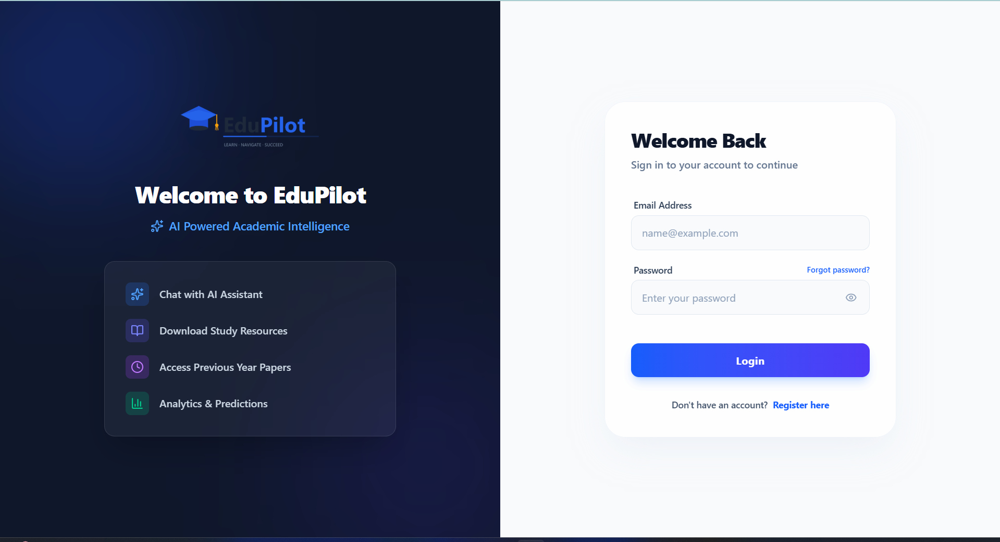

## 2. Student Dashboard

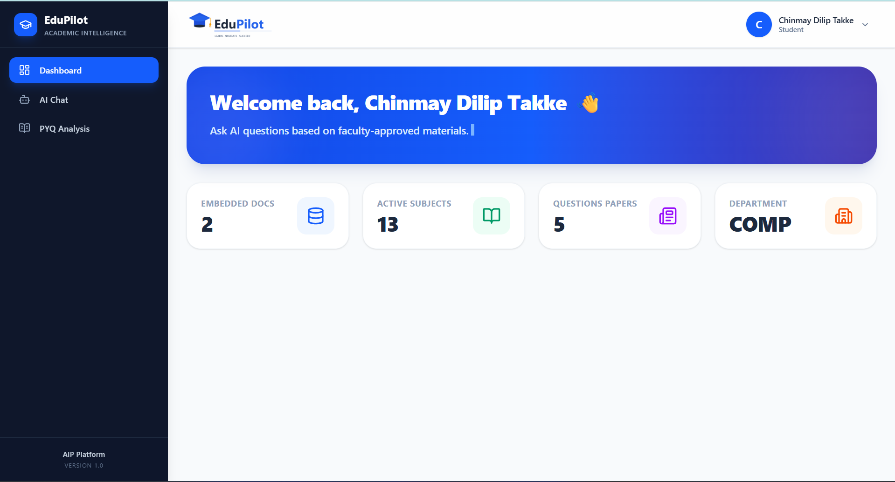

## 3. Academic RAG Chat

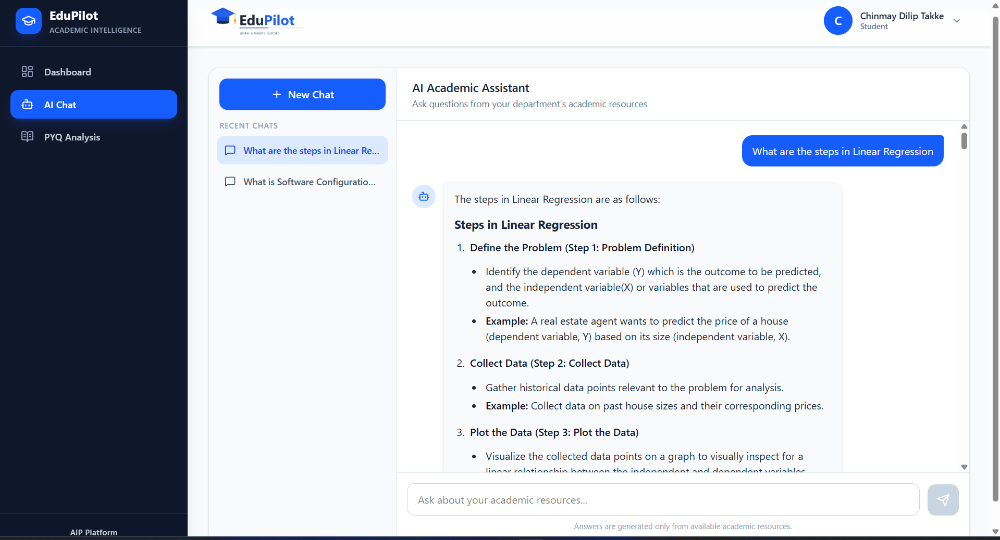

## 4. PYQ Intelligence

### PYQ Analytics Overview

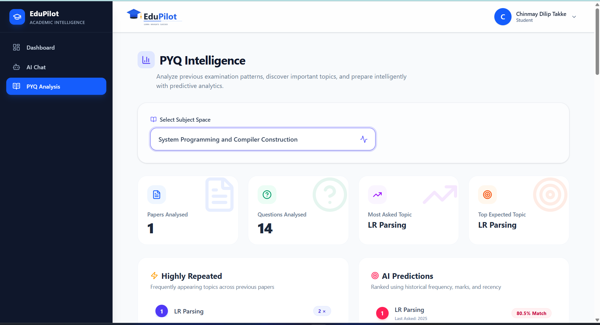

### Topic Analysis

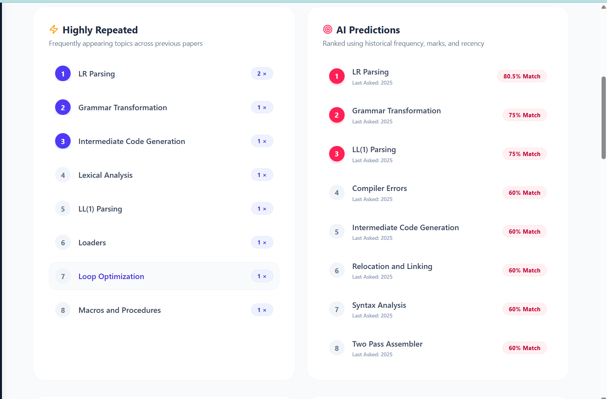

### Examination Pattern Analysis

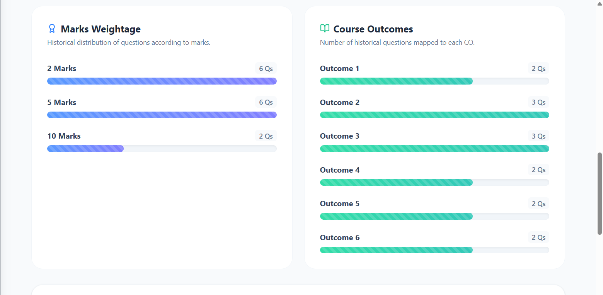

### Expected Topics & Predictions

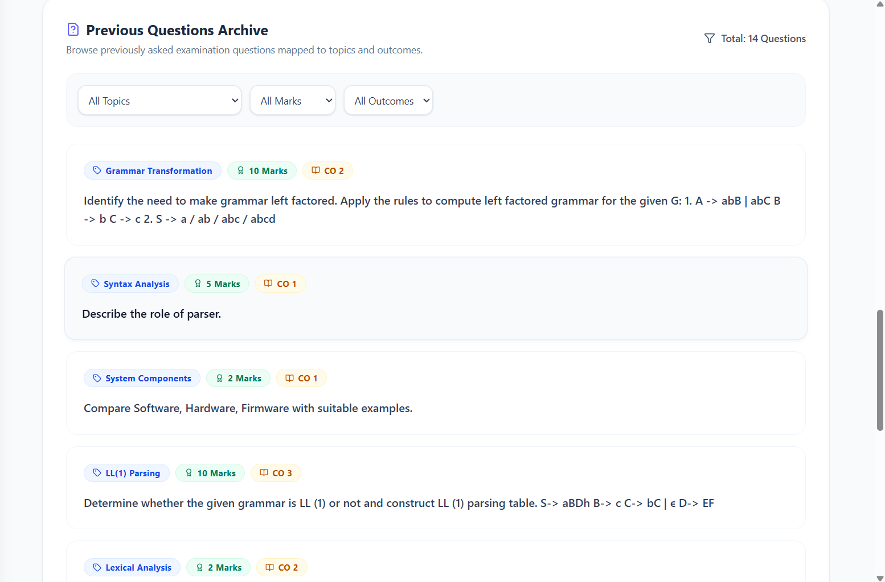

## 5. Faculty Resource Upload

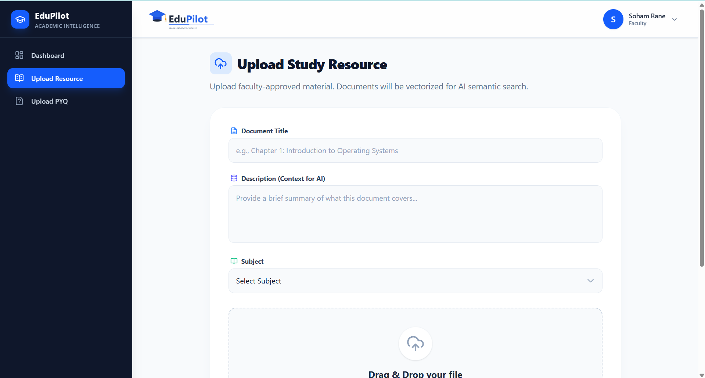

## 6. Faculty PYQ Upload

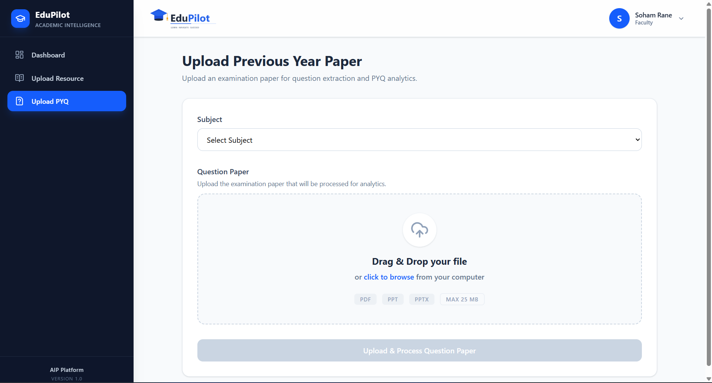

## 7. Department Management

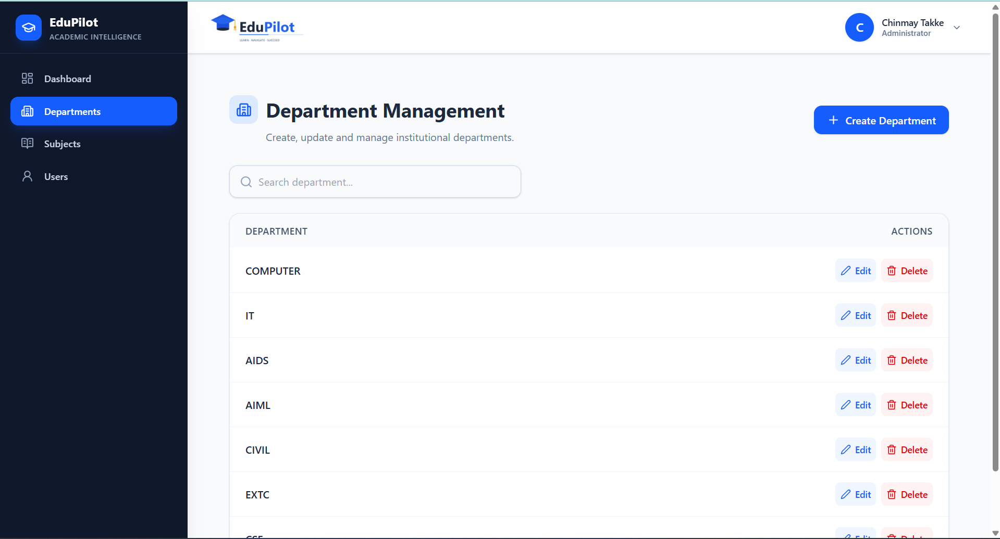

## 8. Subject Management

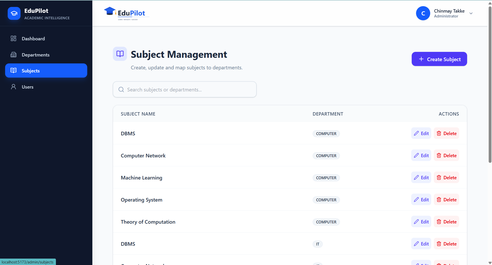

## 9. User Management

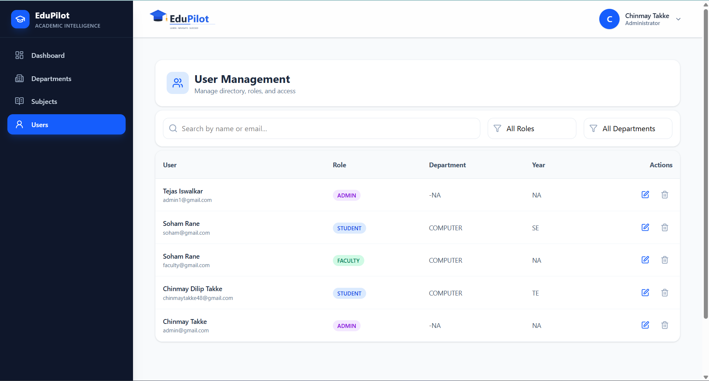

------------------------------------------------------------------------

# Setup and Installation

## Prerequisites

Install the following before running the application:

-   **Java 21**
-   **Maven**
-   **Node.js**
-   **npm**
-   **PostgreSQL**
-   Git
-   A valid Gemini API key

Verify installations:

``` bash
java --version
mvn --version
node --version
npm --version
git --version
```

## 1. Clone the Repository

``` bash
git clone https://github.com/Chinmay48/academic-intelligence-platform.git
cd academic-intelligence-platform
```

## 2. Create the PostgreSQL Database

Create a database for the application.

Example:

``` sql
CREATE DATABASE aip;
```

The default local configuration expects the database name `aip`.

## 3. Configure the Backend

The project uses:

``` text
application.properties
```

Configure your local values.

A representative configuration looks like:

``` properties
spring.application.name=academic-intelligence-platform

spring.datasource.url=jdbc:postgresql://localhost:5432/aip
spring.datasource.username=postgres
spring.datasource.password=${DB_PASSWORD}
spring.datasource.driver-class-name=org.postgresql.Driver

spring.jpa.hibernate.ddl-auto=update
spring.jpa.show-sql=true
spring.jpa.properties.hibernate.format_sql=true

# JWT - 24 hours
jwt.secret=${JWT_SECRET}
jwt.expiration=86400000

spring.servlet.multipart.max-file-size=25MB
spring.servlet.multipart.max-request-size=25MB

gemini.api.key=${GEMINI_API_KEY}
gemini.embedding.url=https://generativelanguage.googleapis.com/v1beta/models/gemini-embedding-001:embedContent
gemini.chat.url=https://generativelanguage.googleapis.com/v1beta/models/gemini-2.5-flash:generateContent
gemini.vision.url=https://generativelanguage.googleapis.com/v1beta/models/gemini-2.5-flash:generateContent
```


## 4. Embedding Storage and Semantic Retrieval

No separate vector database or PostgreSQL vector extension is required.
Document embeddings are generated with `gemini-embedding-001`, serialized, and stored in the `embedding` TEXT field of `document_chunks`. During retrieval, the query is embedded and similarity is calculated in Java using `CosineSimilarityService`.

## 5. Configure File Storage

Uploaded PDF, PPT/PPTX, and DOC/DOCX resources are stored locally under the repository's `uploads/` directory. `LocalStorageService` automatically creates type-specific folders such as `uploads/pdf`, `uploads/ppt`, and `uploads/doc` when required. Ensure the application has permission to write to this directory.

## 6. Run the Backend

Run:

``` bash
mvn spring-boot:run
```

or, when the Maven wrapper is included:

``` bash
./mvnw spring-boot:run
```

On Windows:

``` powershell
.\mvnw.cmd spring-boot:run
```

The development backend is expected at:

``` text
http://localhost:8080
```

and APIs are exposed under:

``` text
/api
```

## 7. Install Frontend Dependencies

Open another terminal:

``` bash
cd Frontend
npm install
```

## 8. Configure the Frontend API URL

The development Axios configuration uses the Spring Boot API base URL:

``` javascript
baseURL: "http://localhost:8080/api"
```

For production, move this to an environment variable.

Example:

``` env
VITE_API_BASE_URL=http://localhost:8080/api
```

Then:

``` javascript
baseURL: import.meta.env.VITE_API_BASE_URL
```

## 9. Start the Frontend

``` bash
npm run dev
```

Open the local URL printed by Vite.

## 10. Initial Application Data

Because subjects depend on departments, a practical initial setup order
is:

``` text
Admin account
      ↓
Create Department
      ↓
Create Subjects
      ↓
Register/associate Faculty and Students
      ↓
Faculty uploads Resources
      ↓
Faculty uploads PYQs
      ↓
Students use RAG + PYQ Intelligence
```

If the application currently requires an administrator to be inserted
manually or registered through a specific process, document that process
here before publishing.

------------------------------------------------------------------------

# Configuration

Before making the repository public, document the exact environment
variables in an `.env.example` or configuration example without secrets.

Suggested example:

``` env
# Database
DB_PASSWORD=

# Security
JWT_SECRET=
JWT_EXPIRATION=

# AI
GEMINI_API_KEY=

# Frontend
VITE_API_BASE_URL=http://localhost:8080/api
```

Only include variable names actually consumed by the final source code.

------------------------------------------------------------------------

# Important Domain Relationships

A simplified data model is:

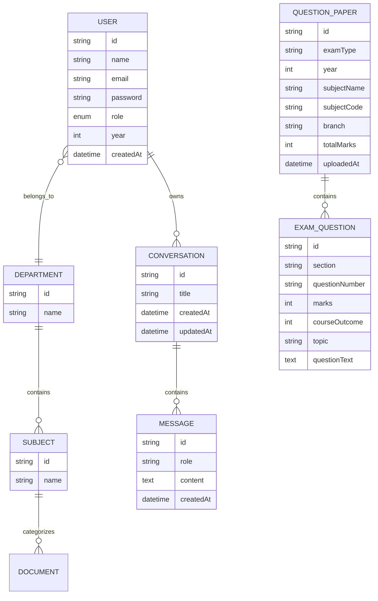

> Document chunks store extracted academic text and serialized embeddings in PostgreSQL. Semantic similarity is evaluated in the application layer.

------------------------------------------------------------------------

# Error Handling and Validation

The project includes validation/error handling for scenarios such as:

-   User not found.
-   Department not found.
-   Subject not found.
-   Conversation not found.
-   Unauthorized conversation access.
-   Duplicate department.
-   Duplicate subject within a department.
-   Empty file upload.
-   Oversized file upload.
-   Invalid resource metadata.
-   Missing academic retrieval context.
-   Low semantic similarity.
-   Invalid/expired authentication token.
-   Unauthorized role access.
-   Failed API operations.

The frontend surfaces relevant failures through toast notifications and
loading/error states.

------------------------------------------------------------------------

# Design Decisions

## Why RAG Instead of a General Chatbot?

A general LLM can produce plausible but unsupported academic
information. EduPilot retrieves institution-provided material first and
instructs the generation model to answer from that context.

## Why Department-Scoped Retrieval?

The same academic term can occur across courses and departments.
Department filtering reduces irrelevant retrieval and ensures students
primarily receive answers from resources intended for their academic
context.

## Why Query Rewriting?

Semantic retrieval performs better with standalone queries.

``` text
"What are the benefits of it?"
```

has weak retrieval meaning by itself.

After conversation-aware rewriting:

``` text
"What are the benefits of Formal Technical Review?"
```

the retriever has a clear semantic target.

## Why Keep Multiple Conversations?

A single permanent conversation causes unrelated topics to accumulate in
memory. Independent conversations:

-   Improve context isolation.
-   Reduce irrelevant history.
-   Provide a familiar chat workflow.
-   Allow students to organize academic discussions.

## Why Separate PYQ Analytics from RAG?

RAG answers questions from academic resources, while PYQ analytics
answers a different problem: historical examination pattern analysis.

Keeping these pipelines separate makes each feature easier to reason
about and prevents examination statistics from being mixed into document
retrieval unnecessarily.

## Why No AI Study Planner?

An AI study planner was considered but intentionally not included in the
final scope.

A meaningful personalized planner would require reliable inputs such as:

-   Student academic performance.
-   Syllabus/module coverage.
-   Available study time.
-   Previous marks.
-   Weak/strong areas.
-   Examination schedule.

Requiring students to repeatedly enter these values would reduce
usefulness, while using only PYQ frequency would duplicate the existing
PYQ Intelligence feature. The project therefore prioritizes fewer,
well-supported capabilities over adding a feature only for feature
count.

------------------------------------------------------------------------

# Future Improvements

Potential extensions, if the project is developed further:

-   Complete source-level citation UX for RAG answers.
-   Streaming chat responses.
-   Hybrid lexical + vector retrieval.
-   Reranking retrieved chunks.
-   Advanced document ingestion status tracking.
-   More robust document format support.
-   Automated evaluation of RAG retrieval quality.
-   Automated hallucination/groundedness evaluation.
-   Password reset email/OTP workflow if not already completed.
-   Cloud object storage for uploaded resources.
-   Optional migration to pgvector or another indexed vector store if the document corpus grows significantly.
-   Redis caching.
-   Rate limiting.
-   Docker/Docker Compose deployment.
-   CI/CD pipeline.
-   Unit and integration test expansion.
-   OpenAPI/Swagger documentation.
-   Observability and centralized logging.
-   More sophisticated PYQ prediction after collecting larger multi-year
    datasets.
-   Student personalization only when sufficient academic data is
    available.

------------------------------------------------------------------------

# Project Highlights

EduPilot demonstrates the integration of:

-   Full-stack React + Spring Boot development.
-   JWT authentication.
-   Role-based authorization.
-   Relational domain modeling.
-   Multipart file handling.
-   Document processing.
-   Embeddings and semantic search.
-   Retrieval-Augmented Generation.
-   Prompt engineering.
-   Conversational memory.
-   Query rewriting/coreference resolution.
-   AI-assisted information extraction.
-   Historical examination analytics.
-   Prediction logic.
-   Responsive role-based UI.
-   Feature-oriented software architecture.

The project focuses on an important distinction:

> **AI should not merely generate academic answers; it should retrieve,
> ground, organize, and analyze trusted academic information.**

------------------------------------------------------------------------

# Author

**Chinmay Dilip Takke**\
Computer Engineering\
Thakur College of Engineering and Technology (TCET), Mumbai

------------------------------------------------------------------------
